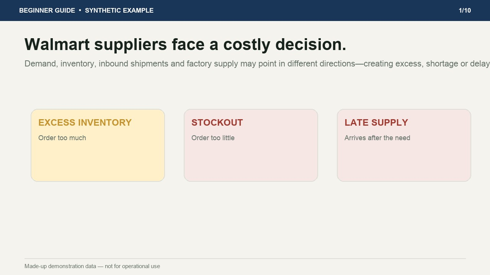

# Walmart Inventory & Commitment Control — Synthetic Demo

> **Synthetic demonstration data — not for operational use**

A local, single-user Django MVP for Jessica. It turns recurring Walmart, warehouse,
shipment, factory, and review files into a dated reconciliation cycle with blocking
exceptions and an exportable inventory-and-commitment schedule.

The Render deployment is a public, read-only demonstration containing only the
made-up complete-workflow cycle. Operational source files and the real partial-data
trial are excluded from the deployment repository.

## Beginner-oriented guided demonstration

[](https://walmart-control-synthetic-demo.onrender.com/demo/)

**[Play the one-minute beginner guide](https://walmart-control-synthetic-demo.onrender.com/demo/)** — start with one practical supply decision, follow a 350-unit shortage calculation, and end with a focused action list.

**[播放一分钟简体中文入门演示](https://walmart-control-synthetic-demo.onrender.com/demo/zh-cn/)**

**[Open the interactive synthetic demo](https://walmart-control-synthetic-demo.onrender.com/)**

The video and hosted application contain only made-up demonstration data and
made-up geographic coordinates. They contain no operational Walmart, RJW,
factory, purchase-order, shipment, inventory, or sales data.

## Start the application

```bash
cd walmart-control
source .venv/bin/activate
python manage.py migrate
python manage.py runserver
```

Open `http://127.0.0.1:8000`.

For a demonstration, use the one-command launcher:

```bash
./run_demo.sh
```

It applies any pending database updates, loads both the real partial-data trial and
the separate synthetic complete-workflow demonstration, and starts the application
at `http://127.0.0.1:8000`.

To prepare and present only one demo:

```bash
./run_partial_demo.sh
./run_synthetic_demo.sh
```

Use `run_partial_demo.sh` with `demo_data/PARTIAL_DATA_DEMO_TALKSCRIPT.md`.
Use `run_synthetic_demo.sh` with `demo_data/SYNTHETIC_DEMO_TALKSCRIPT.md`.

## Load the demonstration cycle

The seed command uses the existing files in `../walmart-export/`:

```bash
python manage.py seed_trial
```

It intentionally demonstrates a partial run. Missing critical supply and commitment
packages remain visible and prevent a final supply conclusion.

## MVP workflow

1. Create a control cycle and cutoff date.
2. Upload the nine input packages.
3. Review file processing and field coverage.
4. Run reconciliation.
5. Resolve blocking exceptions.
6. Record Jessica's status and notes per item.
7. Export the Excel schedule or print the management report to PDF.

## Route-control MVP

Each cycle includes a **Route control** view that separates physical positions
from plans and commitments. The aggregate stage cards filter a supporting item
grid; each item calculation also includes a compact evidence strip and localized
warnings for unproven handoffs. Identifier coverage is summarized as confirmed,
provisional, or unresolved for the items loaded into that cycle.

The first version is server-rendered HTML, CSS, and a small amount of plain
JavaScript. It intentionally does not introduce a frontend build system or
`node_modules`. The synthetic cycle includes an optional MapLibre geography tab
with explicitly made-up coordinates; operational cycles do not plot pins until
an approved location master exists.

Uploaded data stays in `data/` on the local computer and is not sent to the map
provider. The optional geography tab downloads the MapLibre library and public
demonstration tiles from the internet; the reconciliation itself remains local.

## Synthetic complete-workflow demonstration

The nine clearly labeled made-up source files are in `demo_data/synthetic/`. They
populate a separate cycle with three illustrative outcomes: covered surplus,
shortage, and inbound arriving after the applicable MABD. The cycle and every
export are labeled as synthetic and must not be used operationally.

Jessica's presentation notes are in `demo_data/SYNTHETIC_DEMO_TALKSCRIPT.md`.

## Render synthetic demonstration

`render.yaml` defines a free, resettable, read-only deployment. The hosted
configuration displays only the synthetic cycle, blocks uploads and changes,
and recreates the synthetic database whenever the service restarts.

Create a repository containing this `walmart-control` directory, connect that
repository as a Render Blueprint, and apply the included `render.yaml`. Do not
add `data/`, `walmart-export/` or other operational source folders to the
deployment repository.
